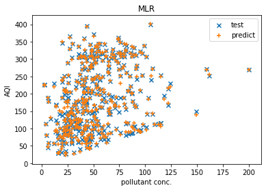
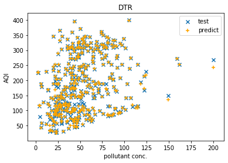
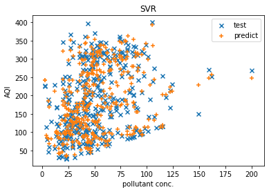
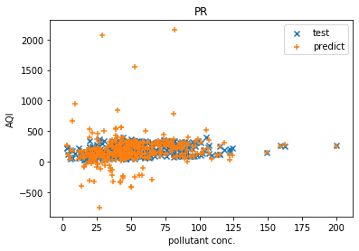

# Predicting-AQI-Comparison-ML-Models

### Objective
This project aims to evaluate different machine learning models to determine which one is most effective in predicting the Air Quality Index (AQI).

### Machine Learning Models Implemented
For this study, we utilized various regression models, including:
* Multiple Linear Regression
* Polynomial Regression
* Decision Tree Regression
* Random Forest Regression
* Support Vector Regression (SVR)

__Libraries Used__: numpy, pandas, sklearn <br/>
__IDE Used__: VSCode

### Setup Instructions
To get started with this project, follow these steps:
1. Clone this repository:
   ```sh
   git clone https://github.com/yourusername/Predicting-AQI-Comparison-ML-Models.git
   cd Predicting-AQI-Comparison-ML-Models
   ```
2. Install the required dependencies:
   ```sh
   pip install -r requirements.txt
   ```
3. Run the Jupyter Notebook or Python script:
   ```sh
   jupyter notebook
   ```
   or
   ```sh
   python main.py
   ```

### Evaluation Metrics
The performance of these models was assessed using the following error metrics:
* Coefficient of determination (R²)
* Root Mean Square Error (RMSE)
* Mean Absolute Error (MAE)
* Root Mean Squared Logarithmic Error (RMSLE)

### AQI Reference Table


### Data Source
The [dataset](https://data.gov.in/resources/real-time-air-quality-index-various-locations) was obtained from the Open Government Data (OGD) Platform India. This platform provides real-time National Air Quality Index values collected from multiple monitoring stations across India. The dataset includes pollutants such as Sulphur Dioxide (SO2), Nitrogen Dioxide (NO2), Particulate Matter (PM10 and PM2.5), Carbon Monoxide (CO), and Ozone (O3), among others. The data is updated on an hourly basis.

### Model Performance
* Training Set Results:

| Models          | R²     | RMSE   | MAE   | RMSLE  |
|---------------|--------|--------|-------|--------|
| MLR           | 0.9965 | 5.9334 | 3.2952 | 0.0595 |
| Decision Tree | 1.0000 | 0.0000 | 0.0000 | 0.0000 |
| Random Forest | 0.9996 | 2.0237 | 0.7106 | 0.0195 |
| SVR           | 0.9494 | 22.628 | 16.076 | 0.1423 |
| Poly R        | 1.0000 | 0.0900 | 0.0180 | 0.0012 |

<hr/>

* Testing Set Results:

| Models         | R²      | RMSE    | MAE    | RMSLE  |
|---------------|--------|--------|-------|--------|
| MLR           | 0.9965 | 5.4973 | 3.4796 | 0.0517 |
| Decision Tree | 0.9955 | 6.2370 | 2.3540 | 0.0563 |
| Random Forest | 0.9982 | 3.8577 | 1.7016 | 0.0422 |
| SVR           | 0.9164 | 27.0025 | 19.0722 | 0.1686 |
| Poly R        | -4.1417 | 211.8759 | 81.5855 | 0.4638 |

### Model Predictions
 
 


### Conclusion
Based on the results, it is clear that the _Random Forest Regressor_ outperformed the other regression models in predicting AQI.

